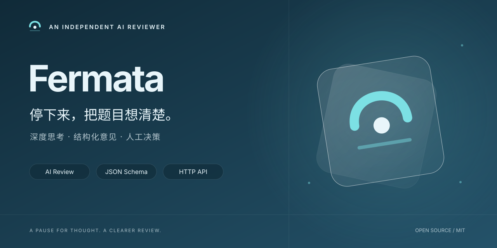

# Fermata

独立部署的 AI 审题服务。先深入分析题意与解法，再整理成可供命题团队复核的结构化意见。

[启动服务](#start) · [配置模型](#configuration) · [HTTP API](docs/http-api.md) · [校准边界](docs/calibration.md) · [报告问题](https://github.com/Huasushis/Fermata/issues)

[](LICENSE)
[](package.json)

- **先思考，再整理**：分开进行深度审阅和 JSON 格式化，结构化结果经过严格校验。
- **可独立运维**：模型、并发、题库连接和凭据可通过管理接口配置，并与题库分开部署。
- **尊重命题流程**：使用授权机器人领取、续租和提交意见；结论是否影响题目状态由题库规则决定。

Fermata（延长记号）意为在此稍作停留。它与 [Urmotiv 命题工作台](https://github.com/Huasushis/Urmotiv) 配合使用，读取题库提供的原题检索资料；不会直接调用 [Anklang](https://github.com/Huasushis/Anklang) 或共享它们的数据库。当前不宣称审题准确率，模型意见仍需人工复核。

<a id="toc"></a>
## 目录

- [背景](#background)
- [状态边界](#status)
- [前置条件](#prerequisites)
- [安装](#install)
- [启动](#start)
- [健康检查](#health)
- [使用](#usage)
- [接口](#api)
- [配置](#configuration)
- [运维与安全](#operations-and-security)
- [测试](#testing)
- [支持](#support)
- [参与贡献](#contributing)
- [维护者](#maintainers)
- [许可证](#license)

<a id="background"></a>
## 背景

Fermata 是 USTC 算法竞赛协会的独立 AI 审题服务。它作为 Urmotiv 机器人客户端领取待审题目，运行分阶段的模型审核流程，再提交结构化意见；同时作为 HTTP 服务端向运维人员和 Urmotiv 的 `fermata-control` 插件提供管理接口。

Fermata 与 Urmotiv 分开部署、分开安装、分开保存凭据，不共享数据库或代码依赖：

- Fermata 只通过 Urmotiv 明确版本化的机器人 API 调用 `claim`、`renew` 和 `complete`。
- Urmotiv 的管理插件只访问 Fermata 的健康、公开设置和唤醒接口；这些接口不是普通用户 API，也不是模型推理 API。
- Fermata 不连接 Urmotiv 的 PostgreSQL、Redis 或对象存储，不执行选手代码，不提供普通用户登录。
- Anklang 的相似题信息若参与审核，只能作为 Urmotiv 任务快照中的受信任输入；Fermata 不读取 Anklang 数据库，也不与 Anklang 运行时互调。

管理接口契约见 [`docs/http-api.md`](docs/http-api.md)。Urmotiv 侧契约在本仓库以严格镜像的 [`src/urmotiv-schemas.ts`](src/urmotiv-schemas.ts) 为准。

<a id="status"></a>
## 状态边界

必须把接口运行性和审题准确性分开理解：

| 证据类别 | 能证明什么 | 不能证明什么 |
| --- | --- | --- |
| 接口、JSON Schema 和启动检查 | 进程按约定启动，管理路由、设置和机器人数据通过格式校验。 | 不能证明模型判断符合人工标准。 |
| `/healthz`、`/api/v1/health` 成功 | HTTP 进程或 worker 的当前运行状态。 | 不能证明任务已领取、审核已提交或评分准确。 |
| 单元测试、类型检查和容器构建 | 当前工程契约在所运行的测试环境中成立。 | 不能替代人工标定。 |

启用服务且模型档位、版本和凭据有效后，Fermata 会通过机器人 API 领取任务。正式评分分两轮：先深度思考审题，再把结论转换成符合 JSON Schema 的意见；领取、续租和提交仍由 Urmotiv 检查权限及题目版本。离线准确性标定不再阻止正式服务运行，运行成功也不代表判断准确。

本仓库不宣称 CF 难度、思维难度、代码难度、标签、质量、原创性或通过/修改/拒绝结论达到任何准确率。难度与通过结论分别判断；缺少查重资料不会阻止审题，也不代表原创。旧多角色实验及历史报告说明保留在 [校准记录](docs/calibration.md)，不作为正式运行的前置条件。私有材料和模型原始输出不进入镜像或 Git。

<a id="prerequisites"></a>
## 前置条件

- Node.js 24 或更高版本（`package.json` 的 engines 约束）。
- npm，以及可写的运行期设置目录。
- 一个可访问的 Urmotiv 服务和由 Urmotiv 授权的机器人令牌。
- `config/models.yaml` 当前默认档位所需的模型服务商凭据；当前支持 `aether` 和 `dashscope`。
- 至少 16 个字符的 Fermata 管理令牌。管理令牌与 Urmotiv 机器人令牌不是同一凭据。
- Docker 部署还需要 Docker Engine；若要运行镜像，反向代理或 Urmotiv 插件只能访问管理端口。

配置模板是 [`.env.example`](.env.example)，只包含变量名和说明。不要把真实令牌、API key、题面、题解或模型输出写入仓库。

<a id="install"></a>
## 安装

从仓库根目录安装锁定依赖：

```bash
npm ci
```

本仓库生产依赖保持精简；开发工具由 `package-lock.json` 固定。安装后可以先运行类型检查而不启动服务：

```bash
npm run typecheck
```

### Docker 镜像

仓库提供 [`Dockerfile`](Dockerfile)，不提供独立 Compose 文件：

```bash
docker build -t fermata:local .
```

镜像只复制运行服务需要的 `config/`、`src/` 和 TypeScript 配置，不复制 `private/`、`.env`、`experiments/` 或 `test/`。运行期设置应通过卷保存。管理令牌由容器平台注入；模型密钥和机器人令牌可以注入环境，也可以通过管理页面加密保存。备份运行设置时须同时保留相邻的 `.key` 文件。

<a id="start"></a>
## 启动

### 使用进程环境

`npm start` 只读取已经注入进程的环境变量，不会自动解析仓库根目录的 `.env` 文件：

```bash
npm start
```

### 使用安全启动器

如需使用环境文件，文件必须位于 Fermata `private/` 下、是当前用户拥有的普通文件，目录权限为 `0700`、文件权限为 `0600`。使用仓库提供的启动器，不要使用 `source` 或 `.`：

```bash
mkdir -p private data
chmod 700 private data
# 由密钥管理器创建 private/fermata.env；不要把真实值粘贴到 shell 历史
chmod 600 private/fermata.env
node scripts/run-with-env.mjs "$PWD/private/fermata.env" npm start
```

开发热加载入口：

```bash
node scripts/run-with-env.mjs "$PWD/private/fermata.env" npm run dev
```

启动时校验管理令牌、URL 形状、环境中的成对 provider 凭据和默认模型档位。模型密钥或机器人令牌尚未提供时，管理页面仍可使用，服务不会领取任务；可在网页中补齐配置。

### 使用 Docker

```bash
mkdir -p data
docker run --name fermata \
  --restart unless-stopped \
  --env-file "$PWD/private/fermata.env" \
  -p 127.0.0.1:8720:8720 \
  -v "$PWD/data:/app/data" \
  fermata:local
```

默认管理端口为 `8720`，设置文件为 `./data/settings.json`。修改 `FERMATA_PORT` 时同步修改端口映射。直接在主机运行或使用 Docker host 网络时，设置 `FERMATA_HOST=127.0.0.1`；默认桥接容器使用 `0.0.0.0` 并仅向主机回环地址发布端口。

<a id="health"></a>
## 健康检查

`/healthz` 是不需要令牌的容器 liveness（存活）探针；它只证明 HTTP 进程可达：

```bash
curl --fail --silent --show-error http://127.0.0.1:8720/healthz
```

成功响应固定为：

```json
{"ok":true}
```

管理健康路由需要 `FERMATA_MANAGEMENT_TOKEN`：

```bash
curl --fail --silent --show-error \
  -H "Authorization: Bearer ${FERMATA_MANAGEMENT_TOKEN}" \
  http://127.0.0.1:8720/api/v1/health
```

它返回 `workerRunning`、`activeTasks` 和 `status`。`workerRunning` 表示调度循环已启动且当前启用条件满足；`status: "ok"` 不证明模型判断准确或已有任务完成。

<a id="usage"></a>
## 使用

首次启动且没有设置文件时，公开设置固定为 `enabled: false`、`revision: 1`。禁用设置不会领取任务，健康接口的 `workerRunning` 为 false。

管理设置使用乐观锁：先读取 `revision`，再在 PUT 中带上同一个 `expectedRevision`。下面只使用合成值：

```bash
curl --fail --silent --show-error \
  -X PUT \
  -H "Authorization: Bearer ${FERMATA_MANAGEMENT_TOKEN}" \
  -H "Content-Type: application/json" \
  --data @- \
  http://127.0.0.1:8720/api/v1/settings/public <<'JSON'
{
  "expectedRevision": 1,
  "settings": {
    "enabled": false,
    "pollingIntervalSeconds": 60,
    "maximumConcurrentTasks": 2,
    "modelProfileName": "review-balanced",
    "experimentVersion": "example-experiment-version"
  }
}
JSON
```

`POST /api/v1/actions/wake` 只请求调度器尽快轮询一次，不修改 `enabled`，不绕过版本、模型凭据或 Urmotiv 权限检查：

```bash
curl --fail --silent --show-error \
  -X POST \
  -H "Authorization: Bearer ${FERMATA_MANAGEMENT_TOKEN}" \
  -H "Content-Type: application/json" \
  --data '{}' \
  http://127.0.0.1:8720/api/v1/actions/wake
```

没有领到任务时，检查机器人账号及令牌权限、是否有可领取的待审核题目，以及题目的外部验题开关。历史题可关闭外部验题以避免重复审核；领取 0 条不等于已处理全部题目。

<a id="api"></a>
## 接口

### Fermata 管理接口

管理 API 的版本写在 `/api/v1` 路径中。除 `GET /healthz` 外，所有路径先检查：

```http
Authorization: Bearer $FERMATA_MANAGEMENT_TOKEN
```

| 方法 | 路径 | 用途 |
| --- | --- | --- |
| `GET` | `/healthz` | 无令牌 liveness；只表示 HTTP 进程可达。 |
| `GET` | `/api/v1/health` | worker 状态和已知降级条件。 |
| `GET` | `/api/v1/logs?level=all&limit=100` | 最近安全运行事件；按 INFO/WARN/ERROR 筛选，最多 200 条。 |
| `GET` | `/api/v1/settings/public` | 公开设置、revision 和 `secretsConfigured`。 |
| `PUT` | `/api/v1/settings/public` | 按 `expectedRevision` 条件更新设置。 |
| `POST` | `/api/v1/actions/wake` | 尽快触发一次轮询。 |

公开设置使用严格 JSON 校验，包含启用状态、轮询间隔、并发，以及模型和题库连接的非敏感配置；密钥采用独立的只写字段，读取只返回是否已配置。字段约束以 [HTTP API](docs/http-api.md) 为准。响应不会包含令牌、API key、数据库连接或其它内部字段。过期的 `expectedRevision` 返回 `409 CONFLICT`；未知字段不会被静默保存。

错误响应使用固定错误码，如 `INVALID_JSON`、`INVALID_BODY`、`UNAUTHENTICATED`、`NOT_FOUND`、`CONFLICT` 和 `PAYLOAD_TOO_LARGE`，不回显题面、密钥或外部服务原文。完整字段约束和 JSON 示例见 [`docs/http-api.md`](docs/http-api.md)。

### Fermata 调用的 Urmotiv 接口

这些是 Fermata 的**出站**请求，不是 Fermata 管理端口上的路由。Fermata 使用另一套 Urmotiv 机器人凭据：

```http
Authorization: Bearer $URMOTIV_ROBOT_TOKEN
X-Urmotiv-API-Version: 1
Content-Type: application/json
```

| 方法和路径 | 用途 |
| --- | --- |
| `POST /api/v1/robot/review-tasks/claim` | 领取待审任务。 |
| `POST /api/v1/robot/review-tasks/{assignmentId}/renew` | 续租任务。 |
| `POST /api/v1/robot/review-tasks/{assignmentId}/complete` | 提交通过严格 Schema 校验的结构化审核意见。 |

任务、续租和完成请求的完整字段以 [`src/urmotiv-schemas.ts`](src/urmotiv-schemas.ts) 与 [`docs/http-api.md`](docs/http-api.md) 为准。任务失败不会伪造完成结果，也不会改变 Urmotiv 的人工流程。

<a id="configuration"></a>
## 配置

所有 URL 必须是没有账号、密码、查询参数或片段的 `http://` 或 `https://` 地址。provider 的 BASE_URL 与 API key 必须同时设置或同时留空。

| 变量 | 默认值 | 作用 |
| --- | --- | --- |
| `URMOTIV_BASE_URL` | `http://127.0.0.1:3000` | Urmotiv 服务基础 URL，也可在网页覆盖。 |
| `URMOTIV_ROBOT_TOKEN` | 无 | 可选的机器人令牌，长度 8–4096；可改在网页配置。 |
| `FERMATA_PORT` | `8720` | 管理 HTTP 端口。 |
| `FERMATA_HOST` | `0.0.0.0` | 监听地址；直接运行或 host 网络使用 `127.0.0.1`。 |
| `FERMATA_MANAGEMENT_TOKEN` | 无 | 管理 API Bearer 令牌，长度 16–4096。 |
| `FERMATA_SETTINGS_PATH` | `./data/settings.json` | 运行设置与加密凭据文件路径，配套 `.key` 文件必须一同备份。 |
| `AETHER_BASE_URL` + `AETHER_API_KEY` | 无 | 项目自身模型服务的地址与密钥；历史变量名，与 OMP 无关。 |
| `DASHSCOPE_BASE_URL` + `DASHSCOPE_API_KEY` | 无 | DashScope 模型服务商凭据，按当前档位决定是否必需。 |
| `CODEFORCES_KEY` + `CODEFORCES_SECRET` | 无 | 仅供离线 Codeforces 工具使用的可选凭据，必须成对设置。 |

在 Urmotiv 的「管理 → 插件 → Fermata → 打开管理页面」中，可以设置模型接口基础地址（OpenAI 兼容）、模型 ID、温度、题库地址、模型 API 密钥、机器人令牌、开关和并发。不必为这些设置修改 YAML 或重启；新任务使用新配置，在途任务保持领取时的模型与连接。

模型密钥由模型服务商提供；机器人令牌在 Urmotiv「服务账号」中生成，需授予登录、读取题目、审题及需要时读取测试资料的权限。轮换机器人令牌后，应把新值保存到 Fermata 管理页。插件连接 Fermata 所用的管理令牌仍由部署环境配置。

密钥输入留空保持原值；明确清除后停止使用该密钥，不自动回退到环境中的旧值。网页配置优先于环境。密钥不在响应中回显，持久化时使用 AES-GCM 加密，配套的 `settings.json.key` 自动生成、权限 0600。备份或迁移时同时保存设置文件与 `.key`；遗失加密密钥会导致已有凭据无法恢复。历史未配置网页密钥的部署继续使用环境中的值。

模型档位与 `experimentVersion` 仍标识部署中的评分流程；网页不要求使用者编辑这些内部标记。修改提示词或难度规则的实验约束不变。

正式服务使用所选档位的 `reviewFlow.adjudicator`，当前为 `deepseek-v4-flash`，不使用 pro。第一轮使用 `thinking: enabled` 与 `reasoning_effort: max`；第二轮及唯一一次格式修复轮明确使用 `thinking: disabled`。省略 thinking 参数会沿用提供商默认值，不能当作关闭思考。

格式轮使用 `response_format: {type: json_object}`，提示词提供完整 JSON Schema，收到结果后严格校验字段、范围及活动知识点。这样不依赖兼容服务支持 `json_schema` 请求参数。两轮持续读取流式输出，不因正常慢速生成而反复重发；明确的 429/502/503/504 按配置有界退避重试。不同题目按 `maximumConcurrentTasks` 并行。

<a id="operations-and-security"></a>
## 运维与安全

### 运维

- 将 `/healthz` 配置为容器 liveness；用受保护的 `/api/v1/health` 观察 worker 和活动任务数。
- 通过 `docker logs --tail=100 fermata` 或受控日志系统检查固定错误码；不要把环境变量、请求头、题面、题解或模型原文写入日志。
- Urmotiv 插件管理页提供「运行日志」，可手动刷新或每 10 秒自动刷新。服务内保留最近 1000 条事件，重启后清空；显示处理阶段、耗时、HTTP 状态和错误码，不返回题目身份、正文、模型原文或密钥。未知消息替换为固定提示，未知错误码归为 `UNEXPECTED_ERROR`。
- 将 `FERMATA_SETTINGS_PATH` 所在目录持久化，并限制 `settings.json` 访问权限；设置文件损坏时应停止并从受控备份恢复，不要自动删除重建。
- 管理设置 PUT 使用最新 `revision`，收到 `409 CONFLICT` 时重新 GET，不要覆盖其他操作员的更新。
- 机器人令牌丢失、租约过期、服务端拒绝或模型 provider 不可用时，先检查对应固定错误类别；不要把 Urmotiv 权限错误当成模型错误。
- 准确性尚未标定，审核意见应由人工复核；是否参与状态汇总由 Urmotiv 的审核规则决定。不要把接口通过改写成准确性结论。

### 安全

- Fermata 使用四类相互独立的凭据边界：调用 Urmotiv 的机器人令牌、访问 Fermata 管理端口的管理令牌、模型 provider key，以及仅供离线工具的可选 Codeforces 凭据。不要混用或互相转发。
- 管理接口使用常量时间 Bearer 比较；公开设置 Schema 严格拒绝未知字段，响应不返回任何 secret。
- `run-with-env.mjs` 不经过 shell 解释环境文件；目录和文件权限、路径身份、大小、UTF-8 和允许的变量都会检查。不要用 `source` 或 `.`。
- 仅在授权的 Urmotiv 机器人范围内领取、续租和提交；Fermata 不执行选手代码，不访问 Urmotiv 内部数据库。
- 离线实验使用的题面、题解、人工 gold、模型原始输出、私有清单和环境文件不进入 Git、镜像、日志或本文档。文档示例只用合成数据。

<a id="testing"></a>
## 测试

测试使用注入的 HTTP、时间和模型依赖，不发起真实外部模型请求。受影响工作区从仓库根目录运行：

```bash
npm run typecheck
npm test
npm run test:durable
docker build -t fermata:verify .
```

这些命令只能证明类型、工程契约和镜像构建在当前环境成立；它们不证明审题准确性。不要为 README 或工程验证启动外部模型校准，也不要运行会读取私有题面或模型密钥的实验命令。

<a id="support"></a>
## 支持

请在 [GitHub Issues](https://github.com/Huasushis/Fermata/issues) 报告可复现问题。附上版本、运行模式、固定错误码和不含敏感内容的健康状态；不要提交题面、题解、模型原文、环境文件、令牌或请求头。

<a id="contributing"></a>
## 参与贡献

1. 从 `main` 创建主题分支，每个提交只覆盖一个可审阅的行为变化。
2. 修改 Urmotiv 契约、管理路由、鉴权、任务租约或失败边界时，同时更新对应镜像、文档和失败路径测试。
3. 保持机器人权限、租约和版本检查，不以接口成功或少量实验结果推断准确性。
4. 运行 [Testing（测试）](#testing) 中的命令；确认 staged 文件没有私有材料、密钥、题面或模型原始输出。
5. Pull request 应写明行为、验证命令和未解决限制，不提交真实校准数据。

<a id="maintainers"></a>
## 维护者

- [Huasushis](https://github.com/Huasushis)

<a id="license"></a>
## 许可证

本项目采用 MIT License，完整文本见 [`LICENSE`](LICENSE)。

SPDX-License-Identifier: MIT
本轮针对“基础题面/题解被按比赛定稿审查”修正了评分提示词，并加入合成尺度案例。7 个固定样本前后完整对照见 [基础投稿审核尺度说明](docs/basic-proposal-review-20260921.md)，不将小样本结果宣称为总体准确率。
